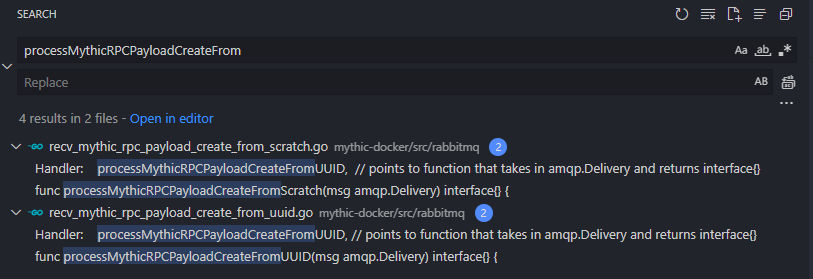

# My Journey on Integrating Sliver into Mythic

There are certainly a lot of C2 frameworks available to choose as a pentester. You might even consider running a [contest](https://commoninja.site/atomics-on-a-friday) to decide which is best. 

Clearly Mythic and Sliver are top-tier, but which should you use? What if you didn't have to decide? I wanted to find out what it would take to use Mythic to control Sliver. 

Quick and easy project right?


### Background

What is [Sliver](https://sliver.sh/)? 
```
Sliver is a powerful command and control (C2) framework designed to provide advanced capabilities for covertly managing and controlling remote systems. With Sliver, security professionals, red teams, and penetration testers can easily establish a secure and reliable communication channel over Mutual TLS, HTTP(S), DNS, or Wireguard with target machines.
```

What is [Mythic](https://docs.mythic-c2.net/)?
```
Mythic is a multiplayer, C2 platform for red teaming operations. It is designed to facilitate a plug-n-play architecture where new agents, communication channels, and modifications can happen on the fly. Some of the Mythic project's main goals are to provide quality of life improvements to operators, improve maintainability of agents, enable customizations, and provide more robust data analytic capabilities to operations
```

So while Sliver provides an 'all in one' solution for building and managing implants, Mythic by default only provides an 'agnostic' architecture for controlling any [compatible implant](https://github.com/MythicAgents) over any [compatible communication](https://github.com/MythicC2Profiles). You install which agents and profiles you want to use, and can add your own custom ones as well. 

Not only that, but Mythic provides awesome UI to view data that's pulled back from targets, for example a [file browser](https://docs.mythic-c2.net/operational-pieces/file-browser). I didn't yet know how, but I really wanted to type 'ls' into Mythic instead of the Sliver cli and see that awesomeness.

Before:


After:


## Step 1 - Research

Ok, I have my end goal in mind, but how do I start? When in doubt, read all the documentation you can! 

I started with learning about [Sliver's Architecture](https://sliver.sh/docs?name=Architecture). Looks like there's a client that connects to a server using gRPC. There's even a page on how to create a [Custom Client](https://sliver.sh/docs?name=Custom+Clients). Sweeeeeet. 

Time to get smart on Mythic. The [documentation](https://docs.mythic-c2.net/) is pretty spectacular, but I learned a lot from [this video](https://www.youtube.com/watch?v=xdmdHMjK1KA) on creating a custom agent, and [this video](https://www.youtube.com/watch?v=eL0y73FNrNI) showing some awesome features. Youtube is basically where I learn everything.

I didn't want to do this alone, so I did what anyone would do and DM'd the creator of Mythic [@its_a_feature_](https://twitter.com/its_a_feature_?lang=en) directly.


Through some further research there, I confirmed my idea was technically feasible, and that I could reference a few similar agents that were designed as 3rd party service integrations ([bloodhound](https://github.com/MythicAgents/bloodhound), [ghostwriter](https://github.com/MythicAgents/ghostwriter), [nemesis](https://github.com/MythicAgents/nemesis)).

## Step 2 - Planning

Now that I sorta know how things work, where exactly would my solution fit? 

One assumption I wanted to make was that the sliver server was already up and running with active implants. I didn't want my solution to require any changes to how sliver was installed, and allow operators to continue using Sliver like normal. This meant I was squarely within the domain of Mythic. 

### What is the flow?

In order to type 'ls' and get results, that task needs to get to the implant and return. After some thought, I came up with 3 possible scenarios.

1) ❌Sliver C2 handled by Mythic
    - pros: Avoids needing the sliver-server
    - cons: Way to hard for me to implement
2) ❌Mythic could use the existing sliver-client
    - pros: Fully functional
    - cons: sounds gross and full of string parsing hell
3) ✅Mythic can connect to the sliver-server using gRPC
    - pros: no functional limitations, since thats how the real client works

### gRPC? What?

I haven't really used gRPC, though I sorta know why it exists and why it would be used by teams. But how would I go about using it? Sliver offers a few pre-cooked [choices](https://sliver.sh/docs?name=Custom%20Clients), and even a [discontinued gui controller](https://github.com/BishopFox/sliver-gui).


1) ❌[sliver-script](https://github.com/moloch--/sliver-script) (typescript)
    - pros: I have a lot of experience with TS
    - cons: this repo is very outdated
    - cons: Mythic doesn't support TS
2) ❌I could write a custom client in go
    - pros: Mythic supports go!
    - pros: Would be easy to copy from [sliver-client](https://github.com/BishopFox/sliver/tree/master/client)
    - cons: I don't know go 😢
3) ✅[sliver-py](https://github.com/moloch--/sliver-py)
    - pros: Mythic supports python!
    - pros: It's updated
    - pros: I know python fairly well!

## Step 3 - Initial Testing

Cool cool cool. Time to get my hands dirty with code. I spun up a fresh Ubuntu 22 VM, created some snapshots, and installed Sliver. Then I [generated](https://sliver.sh/docs?name=Multi-player%20Mode) an operator config so that I could connect to it remotely using sliver-py. 


Sliver-py was having an extremely difficult time connecting. I found the [known issue](https://github.com/moloch--/sliver-py/issues/28) in the github, but took me wayyy longer than it should to implement the fix. 

The readme mentioned the error and gave a one line fix that didn't work. Another comment titled "I got a better fix!" didn't work, and I was hesitant to try their earlier fix. Turns out, their [first comment](https://github.com/moloch--/sliver-py/issues/28#issuecomment-1469011869) in the thread was the only one that managed to work for me. Yay.

### Walk before Running

Once I had the sliver-py example usage working, next step was to try something a little more custom. Something like generating an implant. Luckily, this wasn't too difficult using vscode's intellisense and a little trial and error. 

```py
import asyncio
from sliver import SliverClientConfig, SliverClient, client_pb2

CONFIG_PATH = "/workspaces/slithic/mythic.cfg"

async def main():
    config = SliverClientConfig.parse_config_file(CONFIG_PATH)
    client = SliverClient(config)
    await client.connect()

    implant_config = client_pb2.ImplantConfig(
        IsBeacon=True,
        Name="sliver-pytest-1",
        GOARCH="amd64",
        GOOS="linux",
        Format=client_pb2.OutputFormat.EXECUTABLE,
        ObfuscateSymbols=False,
        C2=[client_pb2.ImplantC2(Priority=0, URL="http://localhost:80")],
    )

    implant = await client.generate_implant(implant_config)

    f = open("implant_test_exe", "wb")
    f.write(implant.File.Data)
    f.close()
```

Confident in my abilities, I maneuvered into Mythic. Once it was installed on the same VM, I logged into the Jupyter service to try and get things going manually. There were plenty of example scripts interacting with Mythic's RPC's to inspire me. I pasted my code in and I was quickly able to generate an implant, and then upload that binary into Mythic for tracking and "click to download". 


## Step 4 - Implementing (for realz)

Before starting a more official repo, I reached out again to @its_a_feature_ since I was a little confused on the proper agent development setup. Turns out I could develop and run the code externally, and just connect to Mythic using [rabbitmq](https://docs.mythic-c2.net/customizing/payload-type-development#id-3.2-required-folder-structure). 

Should probably be reading all the words in those docs...

Knowing this, I opted to use a [VSCode Devcontainer](https://code.visualstudio.com/docs/devcontainers/containers). I could easily have the base container be the one mythic [provides](https://docs.mythic-c2.net/customizing/payload-type-development#id-3.1-dockerfile) for agent development. With this, anyone could clone the repo, and it would prompt to automatically build and attach to a container with all the required tools.

```Dockerfile
# Dockerfile
FROM itsafeaturemythic/mythic_python_go:latest
RUN pip install sliver-py
# etc...
```

### sliverapi agent

I closely followed the [tutorial](https://docs.mythic-c2.net/customizing/payload-type-development) for a basic agent, and cross referenced the bloodhound agent for any weirdness in being a 3rd party agent. The UI flow was pretty simple.

Select `sliver` when creating a payload, upload the operator config as a parameter, and then a callback appears after building. 

It also wasn't too bad adding commands, just copy/paste from another agent and change the code to interact with sliver, same as the sliver-py readme.

SUCCESS!!!!


I could now issue tasks like 'sessions', and had a clear way to implement the other tasks. Some commands required arguments, but again, easy enough to copy/paste from other agents. 

Not only that, but my setup made it easy to set breakpoints and inspect what data was actually being passed from Mythic/Sliver to my code.

At this point, I could start an mtls listener, list sessions, and few other basic queries. Now I was ready to 'use' an implant.


### sliverimplant agent

First step to even getting this callback was to issue a 'use' command, similar to the sliver-client implementation. However, the RPC call I thought I had to use `SendMythicRPCPayloadCreateFromScratch` wasn't working quite like I thought it should. 

Luckily, I'm a smart dev and remembered to check the logs.

```json
{"level":"error","error":"sql: no rows in result set","func":"github.com/its-a-feature/Mythic/rabbitmq.MythicRPCPayloadCreateFromUUID","line":61,"time":"2024-04-05T21:54:55Z","message":"Failed to get payload"}
```

Uh oh, looks like its calling the wrong function?



@Its_a_feature_ confirms via DM and quickly pushes the fix!


Seriously, that guy was awesome throughout this whole endeavor. I would mention something slightly buggy and within minutes he would respond with "fixed, pull the latest".

Once that's resolved, I'm making callbacks like no one's business. First few commands are also pretty simple.

Things like `netstat`, `ifconfig`, and `pwd`

Then I started adding slightly more complex ones like `upload` and `download`, which would [hook](https://docs.mythic-c2.net/customizing/hooking-features/download) into Mythic and get shown in the UI. 

## Step 5 - Problem Solving

At this point, I was pretty confident in how the project was going. However, everything changed when I went to implement the `shell` command.

This command would spawn a shell with optional pty, and you could use it interactively. I really wanted this implemented since Mythic had UI to easily support interactive commands for this exact purpose!


But...Oh No! sliver-py doesn't implement 'shell' like most of the other commands. 

Up until this point, my functions looked almost all like this...
```py
async def netstat(taskData: PTTaskMessageAllData):
    interact, isBeacon = await create_sliver_interact(taskData)

    netstat_results = await interact.netstat()

    if (isBeacon): # wait until beacon checkin to get results
        netstat_results = await netstat_results

    return netstat_results
```

Felt kinda cheaty to implement `netstat` with interact.netstat(), but I wasn't complaining. But how the hell am I going to implement an interactive .shell()?

### Struggle

At first I tried to guess my way into it using intellisense and the debugger to see what else was available in the sliver-py client. I also started to look at the sliver-client code, but I wasn't really sure what I was looking for, especially being in go.

At this point, I reached out to some of the Sliver devs. From [this](https://bishopfox.com/tools/sliver) article, I saw their github usernames, then matched those github profile pictures to ones I saw active in the #golang slack channel. They informed me that it was definately feasible, and I would only need a few RPC calls.

I made some slight progress once I figured out how to use the ._stub and other normally private variables. I could see a /bin/bash spawned in the process list. Something about a tunnel, but not really sure how its actually working.

```py
interact = await client.interact_session(taskData.Payload.UUID)

tunnel_thing = sliver_pb2.Tunnel(SessionID=interact.session_id)
tunnel = await interact._stub.CreateTunnel(tunnel_thing)

shellreq = sliver_pb2.ShellReq(Path="/bin/bash", EnablePTY=True, TunnelID=tunnel.TunnelID)
shell_result = await interact._stub.Shell(interact._request(shellreq))

# TODO: figure out how to loop through input / output with tunnel
```

Then, out of nowhere, I discovered that sliver-script had implemented .shell()! Another example for me to pull from that I could now actually understand. 

Progress was extremely slow, so slow that I had considered refactoring entirely to go in order to exactly match the sliver-client. I reached out some of my co-workers for their advice. One mentioned to only focus on writing data to the shell first before reading the results. Good call.

I could send something like `sleep 500 &` into the tunnel, and watch the process list in the VM to see if it appeared or not. Intellisense continued to help, though I had to turn off linting.

```py
data = sliver_pb2.TunnelData()
data.TunnelID = tunnelId
data.SessionID = interact.session_id
data.Data = b'sleep 500 &\n'
await _tunnelStream.write(data)
```

Success! Once I saw the process spawned I knew I was almost done.

I spent more time reading documentation on gRPC and asyncio, and eventually was able to read stdout. Then I created a simple loop where I could interact with the shell using my debugger session. Next step, connect it to Mythic's UI. 

Again, @its_a_feature_ came in clutch with another update that allowed me to send interactive tasks. 


And voila! After more tinkering, refactoring, and better understanding of how Mythic was doing threads and asyncio, a working (messy) version. I could even send control characters.


## Step 6 - Profit

I've now met my end goal, with a proof of concept set of Mythic agents that can interact with Sliver. Not only that, but its wonderfully hooked into Mythic's UI. `ps` creates a process browser tree, `ls` creates a file browser tree, etc...

There's also a clear path for continuing to add and refine functionality to have exact parity with the sliver-client. Here's an example [commit](https://github.com/spenceradolph/sliver/commit/ec2f8fdfebfeb7d3a06d1393f677165cf81dca38) of adding the `ping` command.

- Future Ideas:
    - re-implement in go
    - run Sliver inside Mythic
    - harder things like portfwd's
    - auto sync callbacks

### Final Thoughts

I learned a lot over the past couple weeks of implementing this. A big thing was gaining confidence in problem solving. Me from a few years ago probably would have said "oh, guess I can't do shell". Not today. I worked the problem, starting from lots of research and taking tiny steps of progress, asking lots of people for help/advice, and ultimately succeeding!

Big thanks to Cody, Josh, James, Joe, and Ronan!


